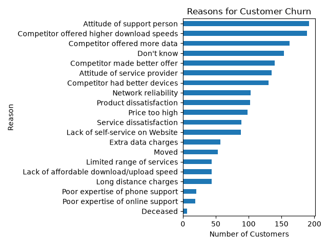
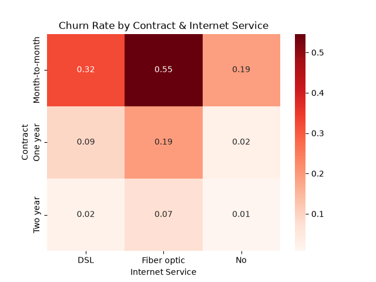

# Telco Customer Churn Prediction

Predicting which customers are likely to cancel their telecom service, and understanding *why* — using the IBM Cognos Analytics Telco Customer Churn dataset (7,043 customers, 33 features).

## Business Problem

Customer acquisition is significantly more expensive than retention. This project identifies which customers are at highest risk of churning and what's actually driving that churn, so a business can act before losing them.

## Dataset

- **Source:** [IBM Telco Customer Churn dataset](https://www.kaggle.com/datasets/yeanzc/telco-customer-churn-ibm-dataset) — originally published as an official IBM Cognos Analytics sample dataset
- **Size:** 7,043 customers, 33 columns
- Includes demographics, account details (contract, tenure, charges), subscribed services, and stated churn reasons

## Tools

Python, pandas, matplotlib, seaborn, scikit-learn

## Data Cleaning

- `Total Charges` was stored as text due to 11 blank entries. Investigation showed these were all customers with `Tenure Months = 0` — brand-new customers with no billing history yet. Filled with **0** rather than the column mean, to avoid fabricating billing history for new customers.
- `Churn Reason` had ~5,174 missing values — these are customers who never churned, so a reason legitimately doesn't apply. Left as-is rather than imputed.

## Exploratory Data Analysis — Key Findings

| Finding | Detail |
|---|---|
| Contract type drives churn | Month-to-month: **42.7%** churn vs One year: 11.3%, Two year: 2.8% |
| Premium service churns more | Fiber optic customers churn at **41.9%** — likely due to higher cost + stronger competitor pressure in that segment |
| Highest-risk segment | Month-to-month + Fiber optic customers churn at **54.6%** — the riskiest identifiable segment in the dataset |
| Top reasons for leaving | Competitor-related reasons (better offers/speeds/devices) account for **621 customers** — the largest cluster. Attitude/service issues account for **327**. Price alone is a smaller factor (**98**) than commonly assumed |




## Modeling

Two features were one-hot encoded (`Contract`, `Internet Service`); data was split 80/20 (train/test).

Since churn is imbalanced (~73% retention baseline), **accuracy alone is misleading** — a model predicting "no churn" for everyone would score ~73% while being useless. **Recall** was prioritized instead, since for this business, missing an actual churner is costlier than a false alarm.

| Model | Recall (Churn) | Precision | Missed Churners | Accuracy |
|---|---|---|---|---|
| Logistic Regression (default) | 0.48 | 0.64 | 207 / 400 | 0.78 |
| **Logistic Regression (balanced)** ✅ | **0.80** | 0.50 | **82 / 400** | 0.71 |
| Random Forest (balanced) | 0.63 | 0.53 | 148 / 400 | 0.74 |

**Final model: Logistic Regression with `class_weight='balanced'`** — correctly caught 318 of 400 actual churners in the test set, prioritizing the business-critical metric (recall) over raw accuracy.

Random Forest's feature importance ranking independently validated the EDA findings — `Total Charges`, `Monthly Charges`, and `Tenure Months` ranked highest, followed by `Contract` and `Internet Service` type.

## Business Recommendation

Retention efforts should prioritize **month-to-month, fiber optic customers with short tenure and high monthly charges** — this segment carries roughly 15x the churn risk of long-contract customers. Since competitor offers and service attitude — not price — are the top stated reasons for leaving, retention strategy should focus on service quality and competitive counter-offers rather than pure discounting.

## Repo Structure

```
├── telco_ibm_churn.xlsx       # raw dataset
├── churn_analysis.py          # full analysis script (EDA + modeling)
├── README.md
```

## How to Run

```bash
pip install pandas matplotlib seaborn scikit-learn openpyxl
python churn_analysis.py
```
